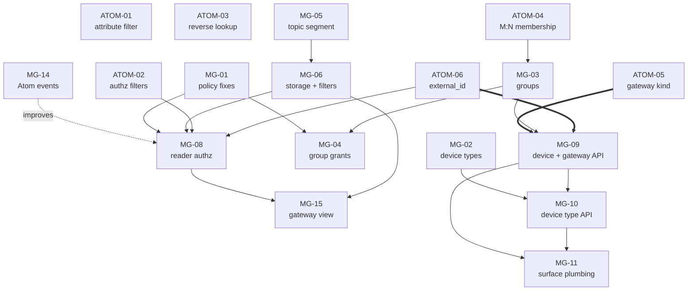

# Edge Model PRDs

Work breakdown for [../architecture.md](../architecture.md). One PRD = one PR.
Atom and Magistrala work are tracked separately because they live in different
repositories and ship independently.

These are living documents — refine as work progresses. Update the **Status**
column here when a PRD's state changes.

## Scope

The deliverable is the **Magistrala model** — see
[../architecture.md](../architecture.md), which is closed and normative.

Bootstrap (PR #3555) and the edge agent are *sources of edge cases*, not work
items: the agent keeps publishing over MQTT as it does today, to a topic with one
extra segment. MG-12 and MG-13 are retained for reference but are **not part of
this programme**. The single thing the model asks of Bootstrap is one attribute
on its Atom projection (`gateway_id`), tracked in MG-12.

## Build order

Six Atom changes and MG-01 unblock everything. After that three tracks run in
parallel, converging on MG-09.

```
P0  ATOM-01 ATOM-02 ATOM-04 ATOM-06   MG-01
        │       │       │       │        │
P1      │       │       ├─ MG-03 ──┐    │       ├─ MG-02
        │       │       │          │    │       │
P2      │       │       │          │    │    MG-05 → MG-06
        │       │       │          │    │              │
P3      │    ATOM-03    │       MG-04   │           MG-08
        │               │               │              │
P4      └──────────── MG-09 ────────────┘           MG-15
                        │
                   MG-10 → MG-11
```

## Repositories

| Prefix   | Repo                 | Language |
| -------- | -------------------- | -------- |
| `ATOM-*` | `absmach/atom`       | Rust     |
| `MG-*`   | `absmach/magistrala` | Go       |

## Priority order

### P0 — Correctness foundations

Nothing else is safe to build on until these land. Two are pure parameter
plumbing in Atom; one fixes defects that the new access model would otherwise
inherit.

| PRD                                                   | Repo | Title                                                   | Depends on | Status |
| ----------------------------------------------------- | ---- | ------------------------------------------------------- | ---------- | ------ |
| [ATOM-01](./ATOM-01-entity-attribute-filter.md)       | Atom | Expose `attributesContains` on entity and group queries | —          | Draft  |
| [ATOM-02](./ATOM-02-authorized-object-ids-filters.md) | Atom | Expose scoping filters on `authorizedObjectIds`         | —          | Draft  |
| [ATOM-04](./ATOM-04-many-to-many-group-membership.md) | Atom | Many-to-many object group membership                    | —          | Draft  |
| [ATOM-06](./ATOM-06-entity-external-id.md)            | Atom | Entity `external_id`, unique per tenant                 | —          | Draft  |
| [MG-01](./MG-01-atom-policy-client-fixes.md)          | MG   | Fix Atom policy client defects                          | —          | Draft  |

ATOM-04 is the largest of the Atom items and the only one touching the
authorization evaluation path. ATOM-01 and ATOM-02 are parameter plumbing —
ATOM-01 backs the gateway→devices reverse lookup and is **required**, not
optional. ATOM-05 and ATOM-06 are permissive migrations.

**ATOM-05 is withdrawn.** Gateway is a capability (`is_gateway`), not an entity
kind — see [spec §8 A12](../architecture.md#8-decision-record). That removes an
Atom migration and the silent trap it carried, where a new kind would have
stripped every gateway's right to publish.

### P1 — Device model in the Atom client

Magistrala's Go client exposes a small subset of what Atom supports. These add
the primitives the model needs. All three are additive.

| PRD                                     | Repo | Title                                       | Depends on   | Status |
| --------------------------------------- | ---- | ------------------------------------------- | ------------ | ------ |
| [MG-02](./MG-02-device-type-client.md)  | MG   | Device Type (Atom Profile) client API       | —            | Draft  |
| [MG-03](./MG-03-group-client.md)        | MG   | Group membership, hierarchy and group kinds | ATOM-04      | Draft  |
| [MG-04](./MG-04-group-scoped-grants.md) | MG   | Group-scoped permission blocks              | MG-01, MG-03 | Draft  |
| [MG-14](./MG-14-atom-event-consumer.md) | MG   | Consume Atom domain events                  | —            | Draft  |

MG-14 is independent of the rest of P1 and can start immediately. MG-08 ships
TTL-only without it, so land it first if you want its authorized-set cache
event-invalidated rather than retrofitted. (Its other original consumer, MG-07's
attachment cache, no longer exists.)

### P2 — Message attribution

Splits "who sent it" from "whose data it is". The core new capability.

| PRD                                                | Repo | Title                                         | Depends on | Status |
| -------------------------------------------------- | ---- | --------------------------------------------- | ---------- | ------ |
| [MG-05](./MG-05-topic-device-segment.md)           | MG   | Topic grammar: device segment and `device_id` | —          | Draft  |
| [MG-06](./MG-06-device-id-storage-filters.md)      | MG   | Persist and filter `device_id`                | MG-05      | Draft  |
| ~~[MG-07](./MG-07-gateway-attachment-enforcement.md)~~ | MG | ~~Gateway publish-on-behalf-of enforcement~~ | — | **Withdrawn** |

MG-07 is withdrawn: the `gateway_id` attachment it enforced no longer exists, and
the channel is now the publish boundary ([spec §8 A7](../architecture.md#8-decision-record)).
That removes the attachment cache and its invalidation entirely.

### P3 — Access enforcement

Closes a live security hole. See [architecture.md §5.6](../architecture.md#56-where-the-current-implementation-fails).

| PRD                                           | Repo | Title                                              | Depends on            | Status |
| --------------------------------------------- | ---- | -------------------------------------------------- | --------------------- | ------ |
| [MG-08](./MG-08-reader-authorization.md)      | MG   | Reader authorization: enforce per-device access    | MG-01, MG-06, ATOM-02, ATOM-06 | Draft |
| [MG-15](./MG-15-gateway-device-view.md)       | MG   | Gateway device view — declared ∪ observed          | MG-06, MG-08, MG-09   | Draft  |
| [ATOM-03](./ATOM-03-reverse-policy-lookup.md) | Atom | Reverse policy lookup: `directPolicies(objectId:)` | —                     | Draft  |

MG-15 must not ship before MG-08: without the authorized-set narrowing, a gateway
roster leaks every device a gateway serves to anyone with channel read.

### P4 — API surface

The breaking rename. Clean break — `Client` is removed, not aliased.

| PRD                                    | Repo | Title                                    | Depends on   | Status |
| -------------------------------------- | ---- | ---------------------------------------- | ------------ | ------ |
| [MG-09](./MG-09-device-gateway-api.md) | MG   | Device, Gateway and the reachability relation | MG-03, ATOM-01, ATOM-06 | Draft |
| [MG-10](./MG-10-device-type-api.md)    | MG   | Device Type API surface                  | MG-02, MG-09 | Draft  |
| [MG-11](./MG-11-surface-plumbing.md)   | MG   | CLI, PAT scopes, permissions, OpenAPI    | MG-09, MG-10 | Draft  |

No separate `gateways` PAT scope or permission block — a gateway is a device.
`/gateways` is a filtered view, not a distinct resource.

### Withdrawn

| PRD | Why |
|---|---|
| [ATOM-05](./ATOM-05-gateway-entity-kind.md) | Gateway is a capability, not an entity kind (spec §8 A12) |
| [MG-07](./MG-07-gateway-attachment-enforcement.md) | The `gateway_id` attachment it enforced no longer exists; the channel is the publish boundary (A7) |

### Out of scope — retained for reference

Provisioning via Bootstrap is **not part of this programme** (see Scope). These
two are kept because they capture real scenarios the model must survive, and
because they will be the starting point if provisioning is picked up later.

| PRD                                             | Repo | Title                                                 | Status |
| ----------------------------------------------- | ---- | ----------------------------------------------------- | ------ |
| [MG-12](./MG-12-bootstrap-device-bindings.md)   | MG   | Bootstrap device/gateway bindings and fleet rendering | Deferred |
| [MG-13](./MG-13-gateway-announced-discovery.md) | MG   | Gateway-announced device discovery                    | Deferred |

Both predate decisions A7 and A8 and would need revising: late binding removes
the need for a pending-device state on the ingest path, and there is no
attachment for a fleet roster to describe.

## Dependency graph



MG-07, MG-12 and MG-13 are omitted — withdrawn and deferred respectively.

## Parallelisation

Three tracks can run concurrently once P0 lands:

- **Atom track** — ATOM-01 through ATOM-05 are independent of each other.
  ATOM-04 is on the critical path for the model track; start it first. ATOM-05
  must be co-released with MG-09, not merged ahead of it.
- **Attribution track** — MG-05 → MG-06 → MG-08 touches messaging and storage.
  Independent of Atom except for MG-08's dependency on ATOM-02.
- **Model track** — MG-02, MG-03, MG-04 touch only `pkg/atom`. MG-02 is
  independent; MG-03 waits on ATOM-04.
- **MG-14** is independent of all three and gated on nothing.

MG-09 is the widest blast radius and should not start until the model track is
settled, since it freezes the public API shape.

## Decisions

The spec is [../architecture.md](../architecture.md) — a single source of truth.
Its **§11 Decision record** holds every question, the options weighed, the ruling
and its consequences. Sections 1–10 are normative; §11 is the rationale.

All code-blocking questions are resolved. Several 🟡 items still gate individual
PRDs and are named in each PRD's Risks section.

## Conventions used in these PRDs

- **Scope** sections are binding. Anything under "Out of scope" belongs to
  another PRD; if it turns out to be unavoidable, amend both PRDs rather than
  widening silently.
- File references are `path:line` against `main` at the time of writing
  (`e8cf13c7f` for Magistrala). Verify before editing — lines drift.
- Every PRD states acceptance criteria as observable behaviour, not as
  "code written".
